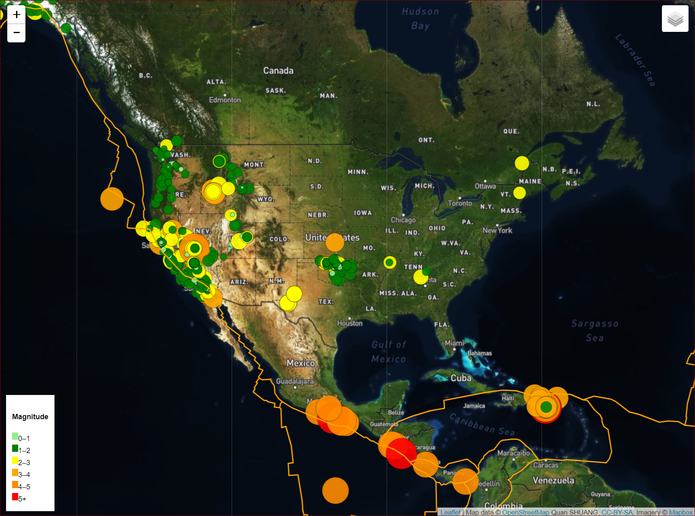

# leaflet-challenge
Leaflet Homework - Visualizing Data with Leaflet

gioleonardo.com/leaflet-challenge: [live](http://gioleonardo.com/leaflet-challenge/)

## Level 1: Basic Visualization
### Get data set and visualize the earthquake data set (gray map)

## Level 2: More Data

### Outdoor map

